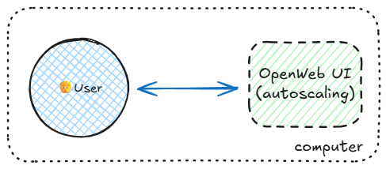
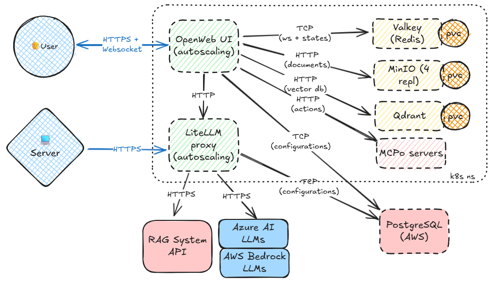

# owuilite

Getting started guide adopting [Open WebUI][#openwebui] and [LiteLLM][#litellm].

## Pre-Requisites

Have docker and docker compose up and running.

## Getting started

The fastest way to start using OpenWebUI chat application is to start it using docker

```bash
docker run -p 3000:8080 --network=host -v open-webui:/app/backend/data --name open-webui ghcr.io/open-webui/open-webui:v0.6.33
```

<details>
<summary>Click to expand the diagram...</summary>


</details>

Then it is proposed to use docker compose to launch the whole solution

```bash
docker compose up
```

<details>
<summary>Click to expand the system context diagram...</summary>



Systems deployed to run the solution :

| System | Description |
|--------|-------------|
| [Open WebUI][#openwebui]  | This is the main user interface. |
| [LiteLLM][#litellm]       | This is the LLMs proxy for exposing Azure LLMs through an OpenAI API specification. |
| [PostgreSQL][#postgresql] | SQL database used to store all configurations and persisted data for OpenWebUI and LiteLLM. |
| [Valkey][#valkey]         | Valkey is a Redis alternative and is used to manage the Websockets for live interactivity with multiple running OpenWebUI instances and sharing some cached states. |
| [Qdrant][#qdrant]         | Vector database used to store vectorized documents uploaded into OpenWebUI and for RAG. |
| [MinIO][#minio]           | Object store used to store uploaded documents from OpenWebUI in a central place. |
| [mcpo][#mcpo]             | NOT CONFIGURED YET. To run officially supported [MCP servers][#mcpserver] for Agentic workflows via MCP. |

</details>

Alternative, start the poutine with observability suite

```bash
docker compose -f compose.yml -f otel.compose.yml up
```

### Configure clis

Set the environment variables to point to local LiteLLM

```bash
make claude
source claude.env

make codex
source codex.env
```

Configure Codex LiteLLM API endpoint

```bash
cat > ~/.codex/config.toml << 'EOF'
# Recall that in TOML, root keys must be listed before tables.
model = "gpt-5-codex"
model_provider = "openai-chat-completions"

[model_providers.openai-chat-completions]
name = "LiteLLM using Responses API"
base_url = "http://localhost:4000"
env_key = "OPENAI_API_KEY"
wire_api = "responses"
EOF
```

[#openwebui]: https://github.com/open-webui/open-webui
[#litellm]: https://github.com/BerriAI/litellm
[#postgresql]: https://www.postgresql.org/
[#valkey]: https://github.com/valkey-io/valkey
[#qdrant]: https://github.com/qdrant/qdrant
[#minio]: https://github.com/minio/minio
[#mcpo]: https://github.com/open-webui/mcpo
[#mcpserver]: https://github.com/modelcontextprotocol/servers